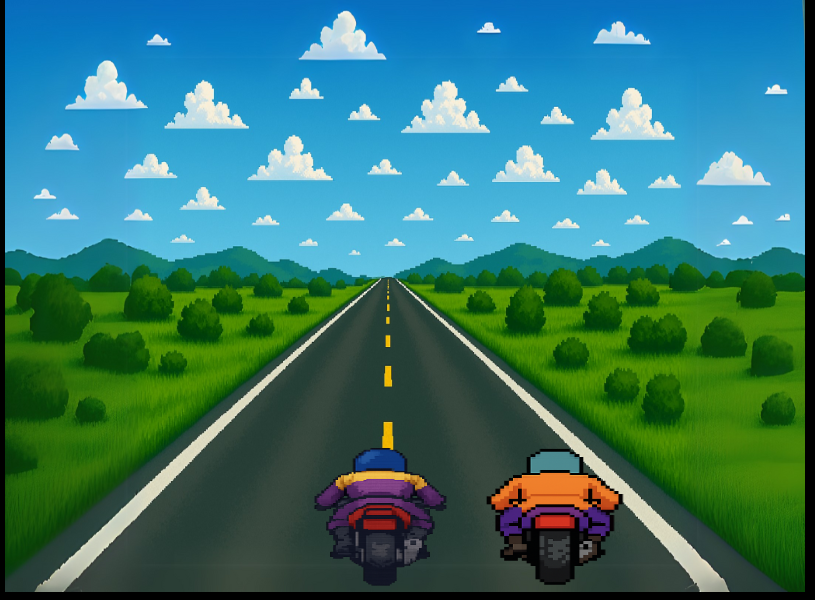
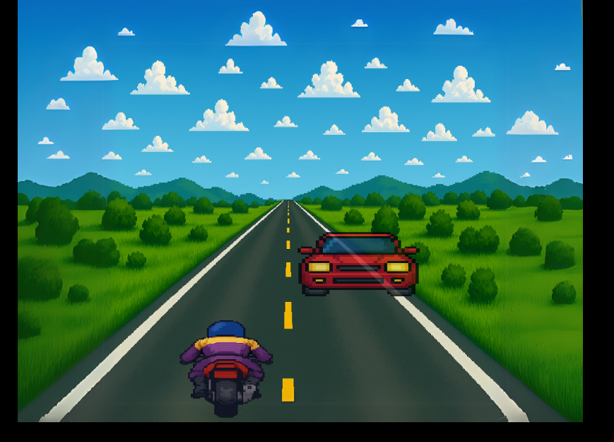

# 🏍️ Road Rash 2D – HTML5 Canvas Biker Game

A fast-paced, retro-style 2D biker racing game inspired by the classic *Road Rash*, built with **HTML5 Canvas** and **JavaScript**. Race, dodge traffic, and knock down opponents as you speed through custom-designed roads with smooth animations and sprite interactions. Perfect for game dev beginners and nostalgic gamers!

> ⚙️ *Built with the help of [ChatGPT](https://openai.com/chatgpt) for logic guidance, debugging, and feature planning.*

## 🎮 Features

- 🏍️ Custom biker sprite with attack animations  
- 🛣️ Side-scrolling road with parallax background  
- 🚗 Oncoming traffic & obstacle collision detection  
- ⌨️ Responsive keyboard controls (`← ↑ ↓ →` + `Space`)

## 🛠️ Tech Stack

- **JavaScript (ES6)**  
- **HTML5 Canvas API**  
- **CSS3** (for optional styling)  
- No external libraries or frameworks

## 📸 Screenshots

## 🚀 Getting Started

Clone/Download the repo and open `index.html` in your browser:
